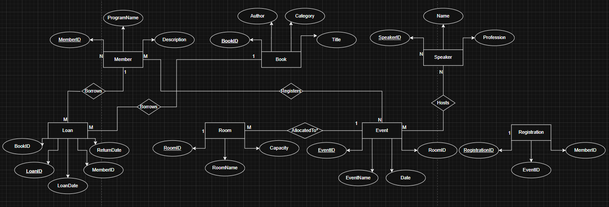
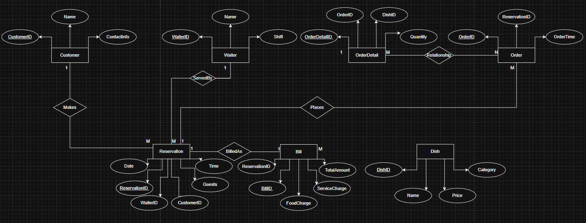

# ER Diagram Workshop – Submission Template

## Objective
To understand and apply ER modeling concepts by creating ER diagrams for real-world applications.

## Purpose
Gain hands-on experience in designing ER diagrams that represent database structure including entities, relationships, attributes, and constraints.

---

# Scenario A: City Fitness Club Management

**Business Context:**  
FlexiFit Gym wants a database to manage its members, trainers, and fitness programs.

**Requirements:**  
- Members register with name, membership type, and start date.  
- Each member can join multiple programs (Yoga, Zumba, Weight Training).  
- Trainers assigned to programs; a program may have multiple trainers.  
- Members may book personal training sessions with trainers.  
- Attendance recorded for each session.  
- Payments tracked for memberships and sessions.

### ER Diagram:

### Entities and Attributes

| Entity     | Attributes (PK, FK) | Notes |
|------------|---------------------|-------|
| Member     | **MemberID (PK)**, Name, MembershipType, StartDate | Tracks registered members |
| Program    | **ProgramID (PK)**, ProgramName, Description | Example: Yoga, Zumba, Weight Training |
| Trainer    | **TrainerID (PK)**, Name, Specialization | Trainers manage one or more programs |
| PersonalSession | **SessionID (PK)**, Date, Time, **MemberID (FK)**, **TrainerID (FK)** | For one-on-one training |
| Attendance | **AttendanceID (PK)**, **SessionID (FK)**, Status | Records if member attended session |
| Payment    | **PaymentID (PK)**, Amount, Date, Type, **MemberID (FK)** | Tracks membership/session payments |

### Relationships and Constraints

| Relationship | Cardinality | Participation | Notes |
|--------------|-------------|---------------|-------|
| Member–Program | M:N | Optional for Member; Mandatory for Program | A member can join many programs |
| Program–Trainer | M:N | Mandatory | Multiple trainers per program |
| Member–Session | 1:M | Mandatory for Session | Each session belongs to one member |
| Trainer–Session | 1:M | Mandatory for Session | Each session has one trainer |
| Session–Attendance | 1:1 | Mandatory | Each session has an attendance record |
| Member–Payment | 1:M | Mandatory for Payment | Payments are linked to members |

### Assumptions
- A session is always linked to both a member and a trainer.  
- Programs cannot exist without at least one trainer.  
- A payment can be for either membership or personal training.  

---

# Scenario B: City Library Event & Book Lending System

**Business Context:**  
The Central Library wants to manage book lending and cultural events.

**Requirements:**  
- Members borrow books, with loan and return dates tracked.  
- Each book has title, author, and category.  
- Library organizes events; members can register.  
- Each event has one or more speakers/authors.  
- Rooms are booked for events and study.  
- Overdue fines apply for late returns.

### ER Diagram:

### Entities and Attributes

| Entity     | Attributes (PK, FK) | Notes |
|------------|---------------------|-------|
| Member     | **MemberID (PK)**, Name, ContactInfo | Library members |
| Book       | **BookID (PK)**, Title, Author, Category | Books available for loan |
| Loan       | **LoanID (PK)**, **BookID (FK)**, **MemberID (FK)**, LoanDate, ReturnDate, Fine | Tracks lending |
| Event      | **EventID (PK)**, EventName, Date, **RoomID (FK)** | Library events |
| Speaker    | **SpeakerID (PK)**, Name, Profession | Speakers/authors |
| Room       | **RoomID (PK)**, RoomName, Capacity | Used for events and study bookings |
| Registration | **RegistrationID (PK)**, **EventID (FK)**, **MemberID (FK)** | Members registering for events |

### Relationships and Constraints

| Relationship | Cardinality | Participation | Notes |
|--------------|-------------|---------------|-------|
| Member–Loan | 1:M | Mandatory for Loan | A member can borrow many books |
| Book–Loan | 1:M | Mandatory for Loan | Each loan is for one book |
| Member–Event (Registration) | M:N | Optional | Members may join multiple events |
| Event–Speaker | M:N | Mandatory | Events can have multiple speakers |
| Event–Room | M:1 | Mandatory | Each event requires one room |

### Assumptions
- Fines are calculated at loan return and stored in Loan.  
- A book can only be loaned to one member at a time.  
- A room can host only one event at a given time.  

---

# Scenario C: Restaurant Table Reservation & Ordering

**Business Context:**  
A popular restaurant wants to manage reservations, orders, and billing.

**Requirements:**  
- Customers can reserve tables or walk in.  
- Each reservation includes date, time, and number of guests.  
- Customers place food orders linked to reservations.  
- Each order contains multiple dishes; dishes belong to categories (starter, main, dessert).  
- Bills generated per reservation, including food and service charges.  
- Waiters assigned to serve reservations.

### ER Diagram:

### Entities and Attributes

| Entity     | Attributes (PK, FK) | Notes |
|------------|---------------------|-------|
| Customer   | **CustomerID (PK)**, Name, ContactInfo | For reservations and walk-ins |
| Reservation | **ReservationID (PK)**, Date, Time, Guests, **CustomerID (FK)**, **WaiterID (FK)** | Tracks table booking |
| Waiter     | **WaiterID (PK)**, Name, Shift | Assigned to reservations |
| Order      | **OrderID (PK)**, **ReservationID (FK)**, OrderTime | Each reservation can place multiple orders |
| Dish       | **DishID (PK)**, Name, Price, Category | Menu items |
| OrderDetail | **OrderDetailID (PK)**, **OrderID (FK)**, **DishID (FK)**, Quantity | Junction table for M:N |
| Bill       | **BillID (PK)**, **ReservationID (FK)**, FoodCharge, ServiceCharge, TotalAmount | Bill generated per reservation |
### Relationships and Constraints

| Relationship | Cardinality | Participation | Notes |
|--------------|-------------|---------------|-------|
| Customer–Reservation | 1:M | Optional for Customer | A customer may reserve multiple times |
| Reservation–Waiter | M:1 | Mandatory | Each reservation assigned a waiter |
| Reservation–Order | 1:M | Mandatory | Each reservation can have multiple orders |
| Order–Dish (via OrderDetail) | M:N | Mandatory | Orders include multiple dishes |
| Reservation–Bill | 1:1 | Mandatory | One bill per reservation |
### Assumptions
- Walk-in customers also generate a reservation record.  
- Service charge is fixed (e.g., 10%) and stored in the Bill.  
- A dish belongs to one category only.

